## Project S2: Student Transcript Website

#### Student: PHAM Phuong Khanh
#### Bsc F2023
***

### I. Website description and page overview
This project aims to create a student transcript dynamic website using Javascript, PHP, HTML, CSS, and SQL.

This website contains 4 mains pages:
- Login
- Welcome
- Population
- Grade
  
Each page contains subpages to control features such as add, edit, set, assign, etc. To provide an overview of my website, I will include some images:

**1. Login page:**

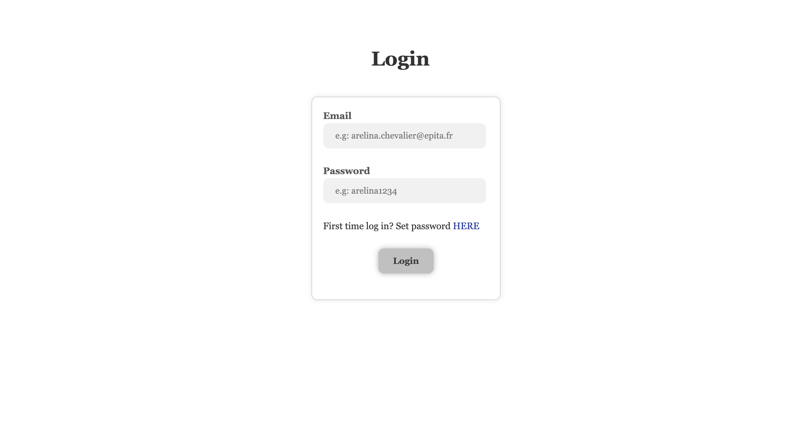

**2. Set password page:**

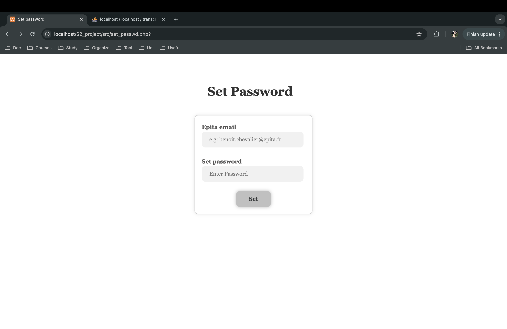

This page for setting your password to be able to login.

**3. Welcome page:**

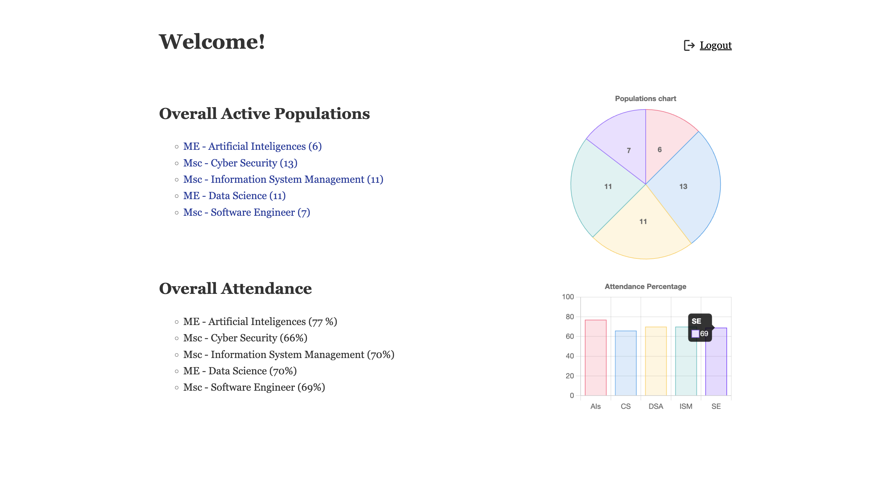
This page contains a list of overall actives populations and lists of attendance as well as 2 dynamic charts for visualization.

**4. Population page:**

    a. Student:

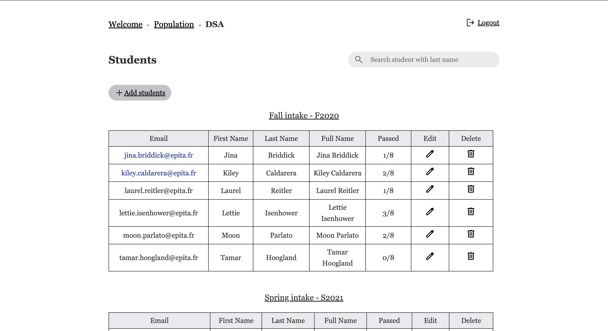

**_Add student page_**

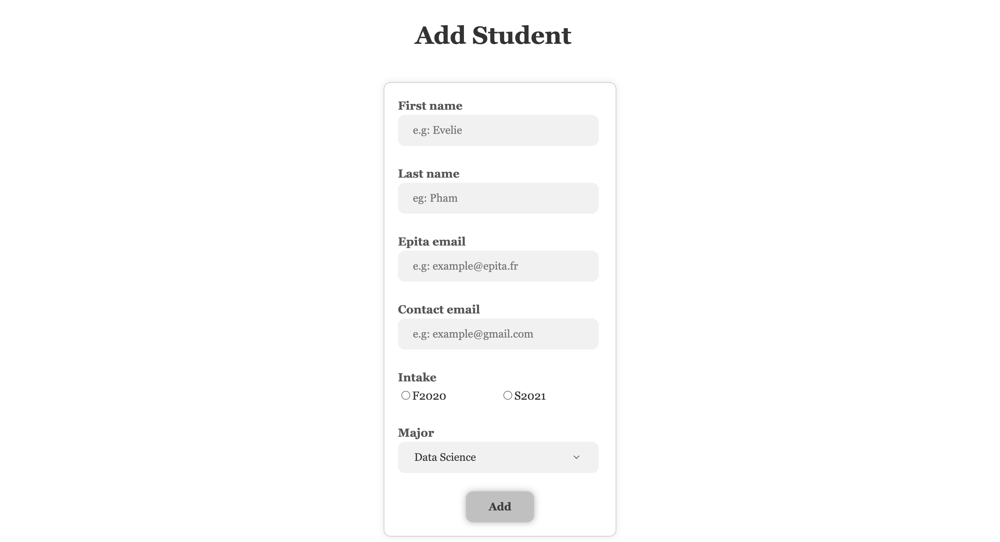

**_Edit student page_**

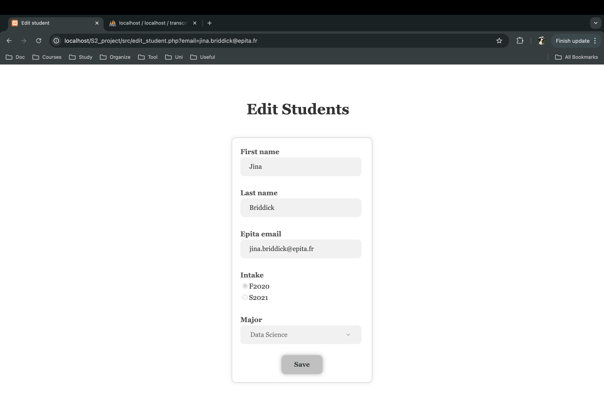

Only student's first name and last name can be changed.

**_Search student page_**

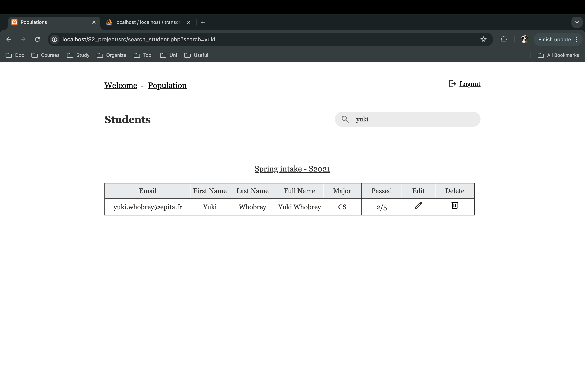

This page displays a list of students matching the search criteria, if no students match it, the page will display a message **"No students found."**

 

    b. Course

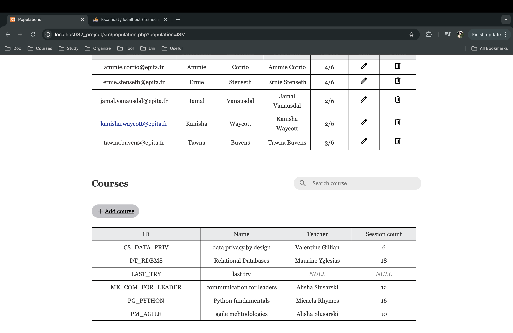

Similar to the students tables, we can also add and search courses but not delete courses.

**_Add course page_**

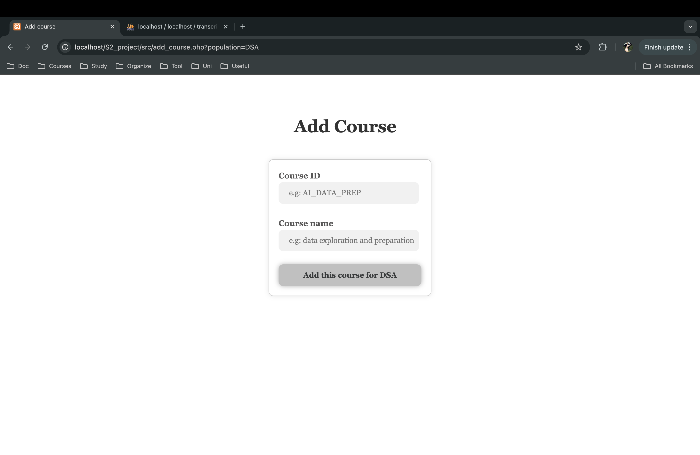

**_Search course page_**

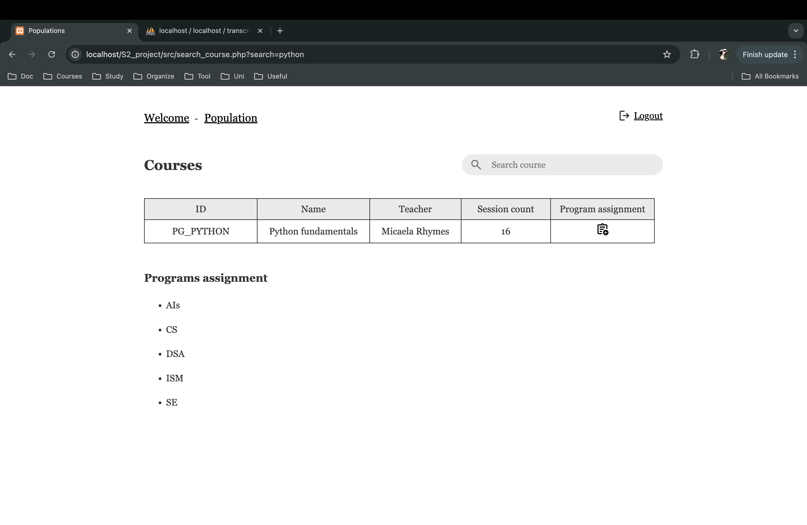

This page displays a list of searched courses and the populations to that thoses courses are assigned.

**_Assign course page_**

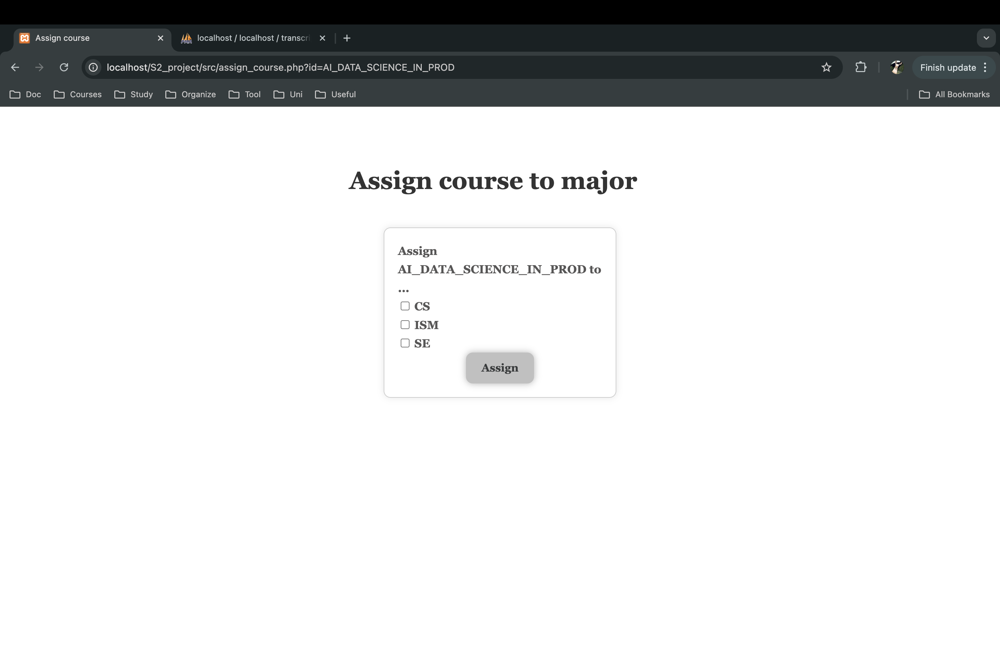

If a course is already assigned to every majors, this page will display a message **"All majors are already assigned."**

**5. Grade page**

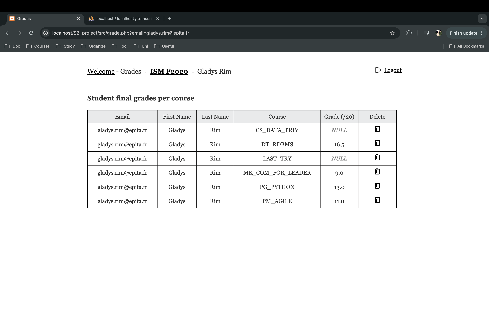
Display grades of each students, allowing deleting grades but instead of delete the whole row, the grade column will be set to null.

***
### II. Code explanation:
   
My project contains 5 components: PHP, HTML and CSS, SQL and Javacript. The backend part is written in PHP, Javacript, SQL and the frontend is written in HTML and CSS.

How does it operate?

**a. PHP:** 

With the backend: I wrote 2 main files: student.php and course.php. Theses files are 2 main classes Student and Course which are tasked with connecting to the database and executing queries. 
- The <b>Student</b> class take care of executing the interactions related to students (add students, delete students, edit students, search students).
- The <b>Course</b> class take charge of the interactions related to courses (add courses, search courses, assign courses).
- Others PHP parts take charge of executing and controling the flow of the website.

With the frontend: The PHP controls what should be displayed in the web page.

**b. SQL:**

SQL statements are encapsulated within methods of the Student and Course classes. Each method is responsible for executing specific queries, such as retrieving data or storing records in the database. This approach ensures organized, maintainable, and reusable database interactions.

**c. HTML, CSS:**

After getting data from the database, HTML and CSS are used to display the information in the database on the web page for the frontend. This approach allows users to interact with the database on the web. Since this is a dynamic web application, all the changes made to the database are visible to the frontend immediately.

**d. JavaScript:**

The JavaScript is used to display the confirmation modal window before triggering the deleting and to create the dynamic charts.
I used PHP to retrieve the data from the database and turn it into json data. JavaScript took that and generated the pie chart and the bar chart on the welcome page.

***
### III. How to run it:

First, we must edit the database by running the queries in the fix_databases.txt file to make sure that all the queries written works properly.

Second, run the website (the instructions are on the videos)

#####  How to login:
1. Open the database and copy a random email address
*Explanation*: Because the website is made for only EPITA's students or teachers so it only accepts an EPITA email **IN THE DATABASE**.
2. Click SET PASSWORD HERE.
3. After setting the password you can now login to the website with the email address that you just chose and the password.

*** 
### IV. Note and Conclusion

Since it is a website of students transcripts, I decided to not add features that I thought it would not make much sense such as Edit or Add grades.

Perhaps this isn't the optimal approach for creating the website and there are multiples others ways to create it. However, the process of coming up with the idea and implementing it has taught me a great deal about creating a real dynamic application, and for that, I am truly grateful.

